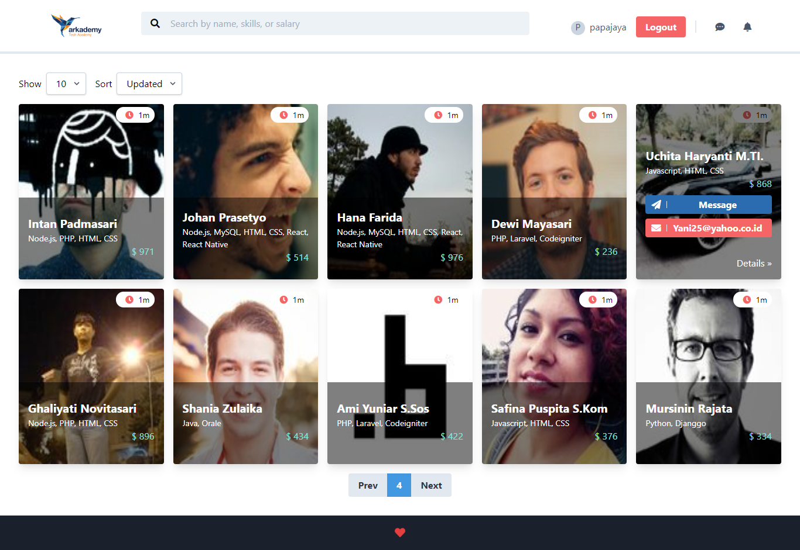
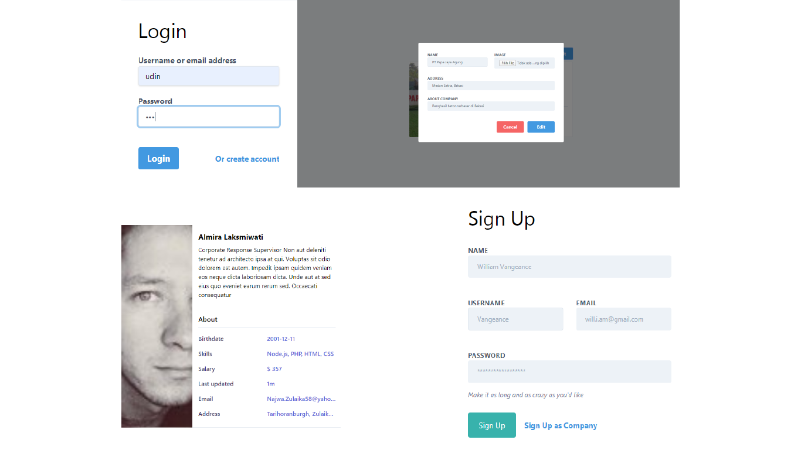

# Hiring Channel API

Hiring Channel is web applications where Engineer and Company can communicate for looking/hiring jobs.

## Built With
* [ReactJS](https://reactjs.org/)

## Requirements
* [Node.js](https://nodejs.org/en/)
* [Yarn](https://yarnpkg.com/lang/en/)
* [ReactJS](https://reactjs.org/)
* [Hiring Channel API](https://github.com/vengeansce/hiring-channel-api/)

## Features
* Sign Up as engineer or company
* Company profile and engineer profile
* Company can see engineer list, skills and expected salary
* Company can send message from email
* And others

## Installation

Use the package manager yarn to install dependencies.

```bash
yarn
```

## Run the app

```bash
yarn start
```

## Screenshots
<div align="center">
    
    
</div>

## Related Project (API)
* [Hiring Channel API](https://github.com/vengeansce/hiring-channel-api/)

## Contributing
Pull requests are welcome. For major changes, please open an issue first to discuss what you would like to change.

Please make sure to update tests as appropriate.

## License
[MIT](https://choosealicense.com/licenses/mit/)
